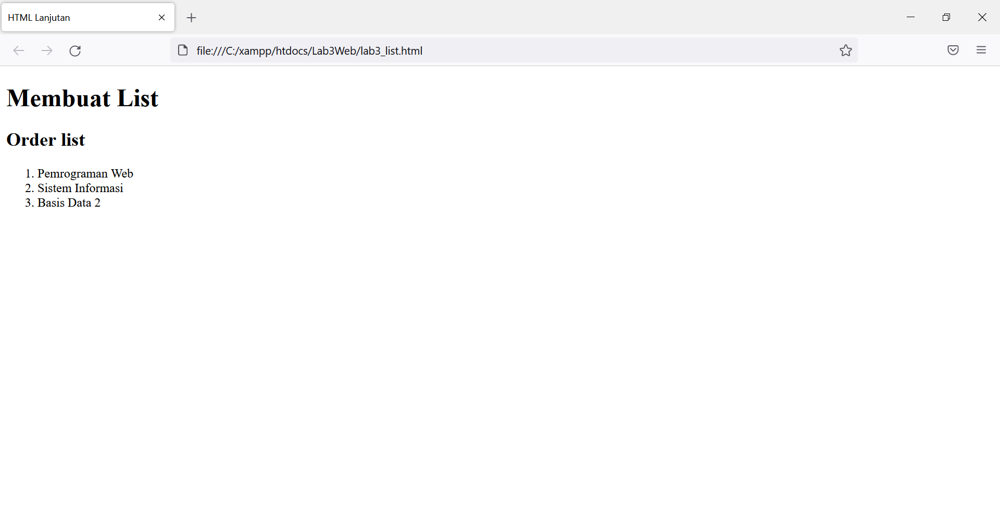
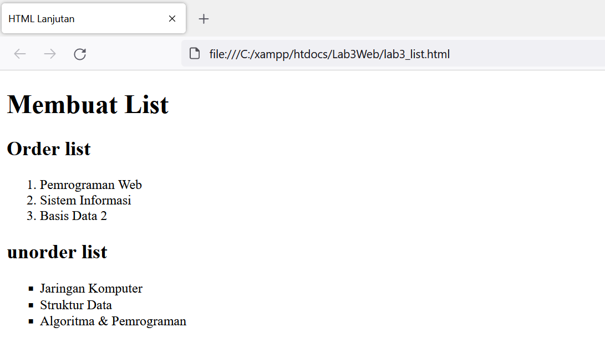
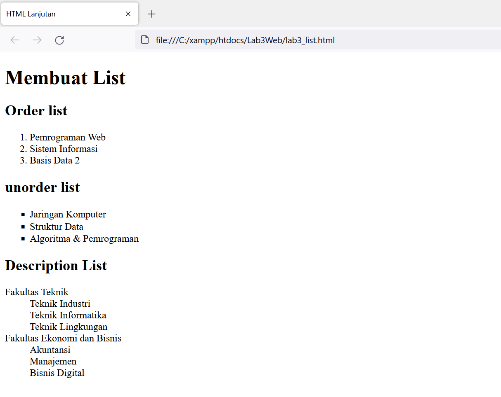
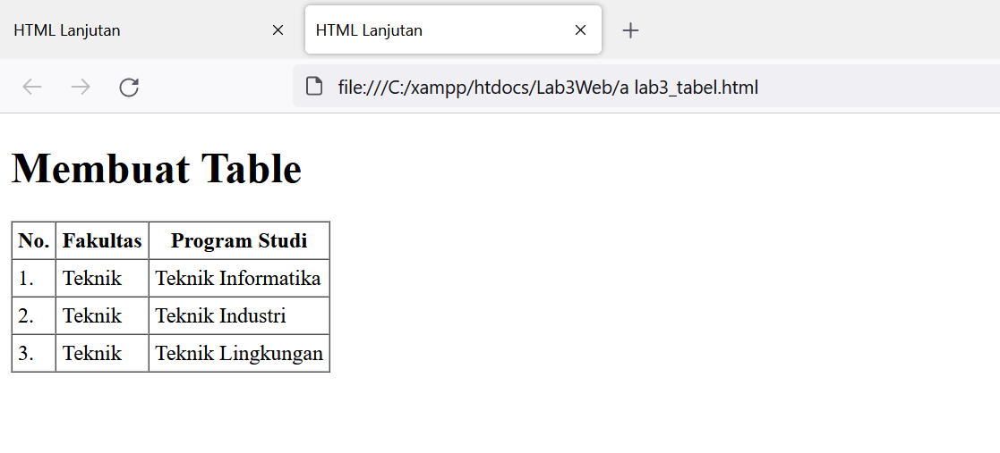
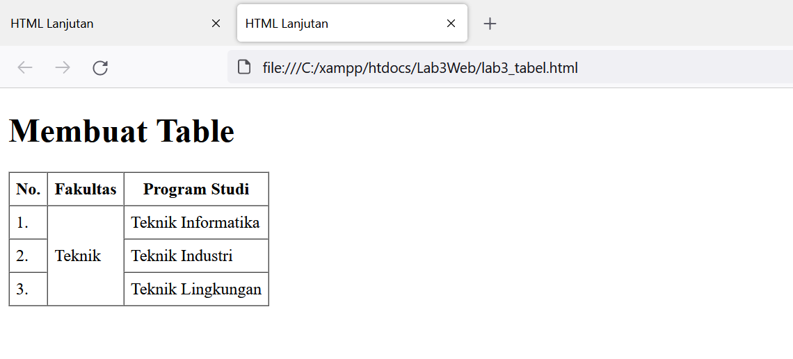
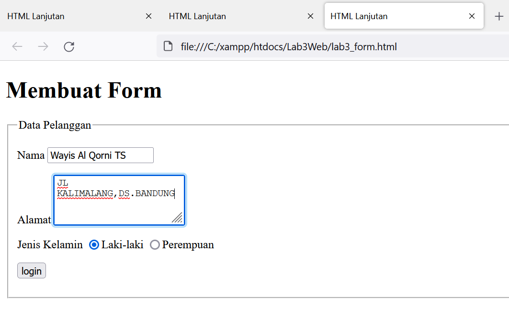
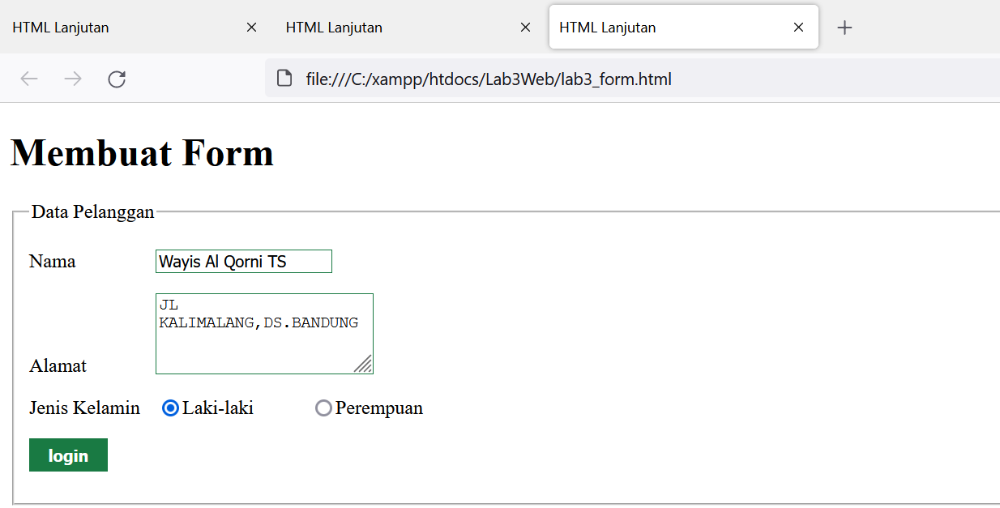

### Lab3Web

## Nama        : Wayis Al Qorni TS
## Nim         : 312010169
## Kelas       : TI.20.A.1
## Mata Kuliah : Pemrograman Web

# 1. Membuat Ordered List
ini adalah kode untuk membuat ordered list:

`<section id="order-list">`
 `<h2>Ordered List</h2>`
 `<ol>`
 `<li>Pemrograman Web</li>`
 `<li>Sistem Informasi</li>`
 `<li>Basis Data 2</li>`
 `</ol>`
 `</section>`

Maka hasilnya akan menjadi seperti gambar dibawah ini:

 

 # 2. Membuat Unorderd List
 Kemudian tambakan kode untuk membuat Unordered List, setelah deklarasi ordered list pada
 section unordered-list, seperti berikut:

`<section id="unorder-list">`
 `<h2>Unordered List</h2>`
 `<ul type="square">`
 `<li>Jaringan Komputer</li>`
 `<li>Struktur Data</li>`
 `<li>Algoritma &amp; Pemrograman</li>`
 `</ul>`
`</section>`

Maka hasilnya akan menjadi seperti gambar dibawah ini:

# 3. Membuat Description List
Kemudian tambahkan kode untuk membuat description list setelah deklarasi unorderd-list.

`<section id="unorder-list">`
 `<h2>Description List</h2>`
 `<dl>`
 `<dt>Fakultas Teknik</dt>`
 `<dd>Teknik Industri</dd>`
 `<dd>Teknik Informatika</dd>`
 `<dd>Teknik Lingkungan</dd>`
 `<dt>Fakultas Ekonomi dan Bisnis</dt>`
 `<dd>Akuntansi</dd>`
 `<dd>Manajemen</dd>`
 `<dd>Bisnis Digital</dd>`
 `</dl>`
`</section>`

Maka hasilnya akan menjadi seperti gambar dibawah ini:

# 4. Membuat Tabel
tambahkan kode untuk membuat tabel sederhana seperti berikut:

`<table border="1" cellpadding="4" cellspacing="0">`
 `<thead>`
 `<tr>`
 `<th>No.</th>`
 `<th>Fakultas</th>`
 `<th>Program Studi</th>`
 `</tr>`
 `</thead>`
 `<tbody>`
 `<tr>`
 `<td>1.</td>`
 `<td>Teknik</td>`
 `<td>Teknik Informatika</td>`
 `</tr>`
 `<tr>`
 `<td>2.</td>`
 `<td>Teknik</td>`
 `<td>Teknik Industri</td>`
 `</tr>`
 `<tr>`
 `<td>3.</td>`
 `<td>Teknik</td>`
 `<td>Teknik Lingkungan</td>`
 `</tr>`
 `</tbody>`
`</table>`

Maka hasilnya akan menjadi seperti gambar dibawah ini:

# 5. Menggabungkan Sel Data
Untuk menggabungkan sel data, gunakan atribut rowspan dan colspan. Atribut rowspan untuk
menggabungkan baris (secara vertikal) dan colspan untuk menggabungkan kolom (secara
horizontal). 

`<table border="1" cellpadding="6" cellspacing="0">`
 `<thead>`
 `<tr>`
 `<th>No.</th>`
 `<th>Fakultas</th>`
 `<th>Program Studi</th>`
 `</tr>`
 `</thead>`
 `<tbody>`
 `<tr>`
 `<td>1.</td>`
 `<td rowspan="3">Teknik</td>`
 `<td>Teknik Informatika</td>`
 `</tr>`
 `<tr>`
 `<td>2.</td>`
 `<td>Teknik Industri</td>`
 `</tr>`
 `<tr>`
 `<td>3.</td>`
 `<td>Teknik Lingkungan</td>`
 `</tr>`
 `</tbody>`
`</table>`

Maka hasilnya akan menjadi seperti gambar dibawah ini:

# 6. Membuat Form
tambahkan kode untuk membuat tabel sederhana seperti berikut:

`<form action="proses.php" method="post">`
 `<fieldset>`
 `<legend>Data Pelanggan</legend>`
 `
`
 `<label for="nama">Nama</label>`
 `<input type="text" id="nama" name="nama">`
 `
`
 `
`
 `<label for="alamat">Alamat</label>`
 `<textarea id="alamat" name="alamat" cols="20" rows="3"></textarea>`
 `
`
 `
`
 `<label>Jenis Kelamin</label>`
 `<input id="jk_l" type="radio" name="kelamin" value="L" /><label for="jk_l">Laki-laki</label>`
 `<input id="jk_p" type="radio" name="kelamin" value="P" /><label for="jk_p">Perempuan</label>`
 `
`
 `
<input type="submit" value="Login">
`
 `</fieldset>`
`</form>`

Maka hasilnya akan menjadi seperti gambar dibawah ini:

# 7. Menabahkan Style pada Form
Agar tampilan form lebih menarik, bisa ditambahkan CSS seperti berikut.

``

Maka hasilnya akan menjadi seperti gambar dibawah ini:

